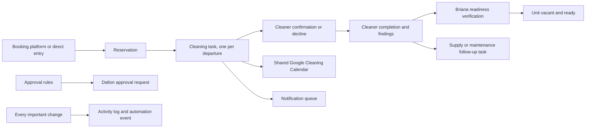

# Homestead Helper V1 — Operations Runbook

## Outcome

Version 1 extends the existing Host Hub into a daily property-operations system without replacing the working guest, payment, availability, maintenance, finance, or reporting features.

The property manager’s default landing page is now the operations command center. The prior Host Hub remains available as **Bookings & calendar**.

## Existing-system assessment

### Reused

- Supabase Auth and session management
- Existing `admin` and `maintenance` roles
- Units, guests, future stays, payments, and payment allocations
- Booking and extension requests
- Availability calendar and external Airbnb availability blocks
- Maintenance intake, assignment, updates, photos, and notification health
- PWA behavior and responsive navigation
- Finance, payment, report, draw, and market pages
- Existing 167-test baseline

### Incomplete before V1

- Guest rows represented both people and stays.
- Unit status did not distinguish ready, dirty, cleaning, maintenance, offline, or renovation states.
- The default dashboard led with unit/finance information instead of operational exceptions.
- Maintenance did not have a vendor directory or configurable owner-approval threshold.
- The Airbnb iCal overlay indicated unavailable dates but could not provide guest identity.
- The generated README did not describe the Homestead Hill system.

### Missing before V1

- Explicit reservations and overlap protection
- Arrival and departure workflow
- Cleaning tasks, cleaner confirmation, completion reporting, and readiness verification
- Vendors, operational tasks, daily checklists, approval rules, activity history, notifications, automation events, and import-run tracking
- Property-manager and cleaner roles
- Expiring, revocable, limited cleaner links
- Idempotent Google Cleaning Calendar and email-delivery adapters

### Security and data-quality findings

- Old migrations initially created public CRUD policies before later migrations restricted core records. Final live policy state must be verified after applying all migrations.
- The existing maintenance photo bucket was publicly readable. V1 replaces that read policy with signed-in staff access. Existing public URLs should be treated as potentially cached and rotated when practical.
- The first property-manager-lane account can claim the first admin role if no admin exists. Preserve this only for disaster bootstrap; confirm Dalton’s admin role before considering removal.
- Destructive legacy guest/payment deletion actions remain irreversible and should be used carefully.
- Legacy guest rows are imported as active reservations only when their checkout is current/future. Historical stays remain in the original tables.
- Airbnb `Channel block` data is availability-only. It must not be treated as verified guest identity or imported as a second reservation.

## Architecture



The browser uses the existing Supabase project. Row-level security keeps owner/property-manager, maintenance, and cleaner access separate. Public cleaner links call one narrowly scoped Edge Function; they never receive direct table access or an administrative session.

Outbound calendar/email work is controlled by `OPERATIONS_DELIVERY_ENABLED`. It must remain `false` until the real calendar, sender, recipients, and a test cleaning are verified.

## Database changes

Migration: `supabase/migrations/20260723154000_homestead_helper_v1.sql`

### Extended tables

- `units`: operational status, property details, secure secret references, notes, and updater
- `guests`: contact, guest/tenant type, emergency/vehicle/pet/communication/access notes, and active flag
- `maintenance_requests`: reservation, vendor, category, priority, emergency, cost, approval, schedule, completion, and verification fields

### New tables

- `reservations`
- `cleaning_tasks`
- `vendors`
- `operational_tasks`
- `checklist_runs`
- `approval_rules`
- `approval_requests`
- `activity_log`
- `notifications`
- `automation_events`
- `cleaner_access_tokens`
- `import_runs`

### Database-enforced workflow

- Confirmed reservation overlaps are rejected unless an explicit owner override is recorded.
- Reservation create/date updates upsert one cleaning task using the departure reservation as the idempotency key.
- Cancellation cancels incomplete cleaning work.
- Checkout sets the unit to vacant and dirty.
- Cleaner completion changes the cleaning to readiness-verification-required; it never marks the unit ready.
- Readiness must pass before the cleaning can become ready.
- Cleaner-reported supplies, damage, or maintenance create visible follow-up tasks.
- Configured maintenance thresholds create pending owner approvals.
- Important operational changes are logged without guest contact or secret fields.

## UI changes

- `/operations`: daily command center and default property-manager landing page
- `/host-hub`: preserved existing unit, calendar, requests, payments, and reports experience
- `/cleaner`: signed-in cleaner assignments
- `/cleaning/:token`: public limited cleaner link
- Mobile navigation now prioritizes Today, Units, Calendar, and Maintenance

The command center includes urgent items, arrivals, departures, same-day turns, approval count, property pulse, 15-unit board, cleaning actions, maintenance, vendors, reusable checklists, and activity history.

## Role setup

Keep Dalton as `admin`.

Assign Briana:

```sql
insert into public.user_roles (email, display_name, role, active)
values ('BRIANA_EMAIL', 'Briana', 'property_manager', true);
```

Assign Wendy either a cleaner account:

```sql
insert into public.user_roles (email, display_name, role, active)
values ('WENDY_EMAIL', 'Wendy', 'cleaner', true);
```

or use expiring cleaner links without an account. Do not put real addresses into source control.

## Google Cleaning Calendar setup

1. Create a dedicated Google Calendar named **Homestead Hill Cleaning**.
2. Use a Google OAuth client that has Calendar event access to only the authorized Dalton/operations account.
3. Complete the one-time consent flow and store the refresh token as a Supabase Edge Function secret.
4. Configure:
   - `GOOGLE_CLIENT_ID`
   - `GOOGLE_CLIENT_SECRET`
   - `GOOGLE_REFRESH_TOKEN`
   - `GOOGLE_CLEANING_CALENDAR_ID`
5. Keep `OPERATIONS_DELIVERY_ENABLED=false`.
6. Create one synthetic cleaning task, set its `calendar_sync_status` to `pending`, invoke `operations-dispatch`, and verify:
   - one event is created,
   - the cleaning task stores the Google event ID,
   - changing the reservation updates that same event,
   - no guest financial information, password, or door code appears.
7. Only after that proof, set new/active cleaning tasks to `pending` and enable delivery.

Calendar event contents are limited to unit, checkout, next check-in, deadline, assigned cleaner, special cleaning notes, and the internal cleaning-task identifier.

## Email setup

V1’s provider adapter uses Resend. Another API provider can replace it behind the same interface.

Configure Edge Function secrets:

- `RESEND_API_KEY`
- `OPERATIONS_EMAIL_FROM`
- `APP_PUBLIC_URL`
- `OPERATIONS_CRON_SECRET`

Verify the sending domain and send one test message to Dalton before enabling operations delivery. Cleaner links can be copied manually before email is verified. Email attempts use notification idempotency keys, retry temporary failures up to three times, and retain permanent failures for review.

Do not add booking-platform passwords, Google credentials, email API keys, or cleaner tokens to browser environment variables.

## Cleaner-link workflow

1. Assign the cleaning task’s cleaner name/email.
2. Choose **Copy cleaner link**.
3. The Edge Function generates a 256-bit random token, stores only its SHA-256 hash, revokes prior active links for that cleaning, and sets a 14-day expiration.
4. Wendy can view that unit’s checkout, next check-in, deadline, and cleaning notes; confirm; decline; start; complete; report supplies/damage/maintenance; and upload restricted images.
5. The link cannot read guest finances, owner information, passwords, Wi-Fi references, door references, other units, or unrelated contacts.
6. Reissuing a link revokes the old one.

## Data import

V1 records import previews in `import_runs`; production imports must remain confirm-before-write.

Use CSV or JSON with:

- a declared source name,
- internal or external identifiers,
- record type,
- confidence,
- normalized unit name/ID,
- source-system timestamps.

The importer must preview creates, matches, conflicts, duplicates, ignored fields, and errors. Do not include passwords, recovery codes, payment credentials, government IDs, or full QuickBooks accounting data. External reservation IDs plus booking source are the preferred reservation idempotency key.

Until a dedicated import screen is approved, use a reviewed SQL/JSON staging script and retain the `import_runs` preview/error record before applying data.

## Environment variables

Browser build:

- `VITE_SUPABASE_URL`
- `VITE_SUPABASE_PUBLISHABLE_KEY`

Supabase Edge Function secrets:

- `APP_PUBLIC_URL`
- `OPERATIONS_DELIVERY_ENABLED`
- `OPERATIONS_CRON_SECRET`
- `GOOGLE_CLIENT_ID`
- `GOOGLE_CLIENT_SECRET`
- `GOOGLE_REFRESH_TOKEN`
- `GOOGLE_CLEANING_CALENDAR_ID`
- `RESEND_API_KEY`
- `OPERATIONS_EMAIL_FROM`

Supabase-provided `SUPABASE_URL` and `SUPABASE_SERVICE_ROLE_KEY` are used only inside Edge Functions.

## Deployment order

1. Back up the Supabase database and confirm restore access.
2. Confirm Dalton’s active `admin` role.
3. Apply the V1 migration.
4. Deploy `cleaner-task-access` and `operations-dispatch`.
5. Set `APP_PUBLIC_URL`; leave delivery disabled.
6. Publish the GitHub commit through Lovable.
7. Assign Briana and Wendy roles.
8. Run the acceptance checklist with synthetic records.
9. Configure and prove Google Calendar.
10. Configure and prove email.
11. Enable delivery only after both proofs pass.

## User acceptance checklist

### Briana

- [ ] Log in and land on Today
- [ ] See urgent items, arrivals, and departures
- [ ] See all 15 unit statuses
- [ ] Find the current occupant and booking source
- [ ] Create a reservation and see exactly one cleaning task
- [ ] Change reservation dates and see the same cleaning task update
- [ ] See same-day turnover urgency
- [ ] See whether Wendy confirmed or declined
- [ ] See the next check-in deadline
- [ ] Create maintenance and assign a vendor
- [ ] See “Dalton approval required” when a configured threshold is exceeded
- [ ] Complete morning and end-of-day checklists
- [ ] Verify cleaning readiness and mark a unit ready
- [ ] Review overdue tasks and activity
- [ ] Complete all critical workflows on a phone

### Wendy

- [ ] Open a valid assignment link without an administrative account
- [ ] See only the assigned unit, checkout, next check-in, deadline, and cleaning notes
- [ ] Confirm and decline
- [ ] Start and complete cleaning
- [ ] Report supplies, damage, and maintenance
- [ ] Upload JPEG, PNG, or WebP photos
- [ ] Confirm unrelated units, guest finances, owner records, and secrets are inaccessible
- [ ] Confirm an expired or reissued link no longer works

### Reliability

- [ ] Overlapping confirmed reservation is rejected
- [ ] Cancellation cancels incomplete cleaning work
- [ ] Calendar retry updates the existing event instead of creating a duplicate
- [ ] Temporary notification failure retries; permanent failure remains visible
- [ ] Cleaner completion never marks the unit ready
- [ ] Activity history records reservation, cleaning, task, approval, and notification changes

## Rollback

Do not use a destructive rollback on live data.

1. Set `OPERATIONS_DELIVERY_ENABLED=false`.
2. Return the property-manager home route to `/host-hub` if the new interface must be hidden.
3. Revoke active cleaner tokens.
4. Stop the operations dispatcher schedule.
5. Revert the application commit and republish through Lovable.
6. Keep the additive V1 tables in place for evidence and export unless a tested database restore is being performed.

Dropping tables, enum values, or operational columns can destroy activity, cleaning, and approval history and is not the normal rollback path.

## Known limitations

- No automatic guest messages are sent.
- Google Calendar and email are coded but remain disabled until verified.
- SMS is an interface-only disabled provider. Grasshopper is not assumed to have a supported SMS API.
- Airbnb iCal remains availability-only; rich guest details require an approved PMS/channel manager or permissioned confirmation-email importer.
- QuickBooks remains separate; vendors store only an optional reference.
- Import runs have a safe audit model, but no general-purpose import UI is shipped.
- Historical guest/payment data is preserved; it is not fully normalized into historical reservations.
- The existing bundle remains large and should be code-split in a later performance pass.

## Recommended Hermes automations

After the manual workflows are accepted, Hermes may consume the sanitized `automation_events` table or a read-only webhook to:

- prepare a morning exception digest,
- alert Briana about unconfirmed cleaning at 72 hours,
- alert Briana and Dalton at 48 hours according to the approval/escalation rules,
- alert on cleaner decline, same-day turnover, overdue cleaning, or emergency maintenance,
- summarize failed notifications,
- prepare an end-of-day unresolved-items handoff.

Hermes must use event IDs and idempotency keys, never receive credentials, never auto-approve spending, and never send guest messages in V1.

## Future SMS notes

Add Twilio, Telnyx, or another verified API provider behind `NotificationProvider`. Require:

- verified sender/recipient consent,
- separate production credentials in Edge Function secrets,
- idempotency keys,
- delivery receipts,
- bounded retries,
- STOP/opt-out handling,
- quiet-hour and emergency rules,
- redacted message templates,
- a one-cleaning canary before general enablement.

Do not use browser automation for SMS and do not hard-code Grasshopper without a documented supported API.

## Decisions required from Dalton

1. Briana’s and Wendy’s role/email assignments.
2. Dollar thresholds for maintenance, emergency maintenance, refunds, discounts, supplies, vendor changes, capital work, reservation exceptions, and pricing exceptions.
3. The Google account/calendar authorization for **Homestead Hill Cleaning**.
4. The verified outbound email domain and sender.

